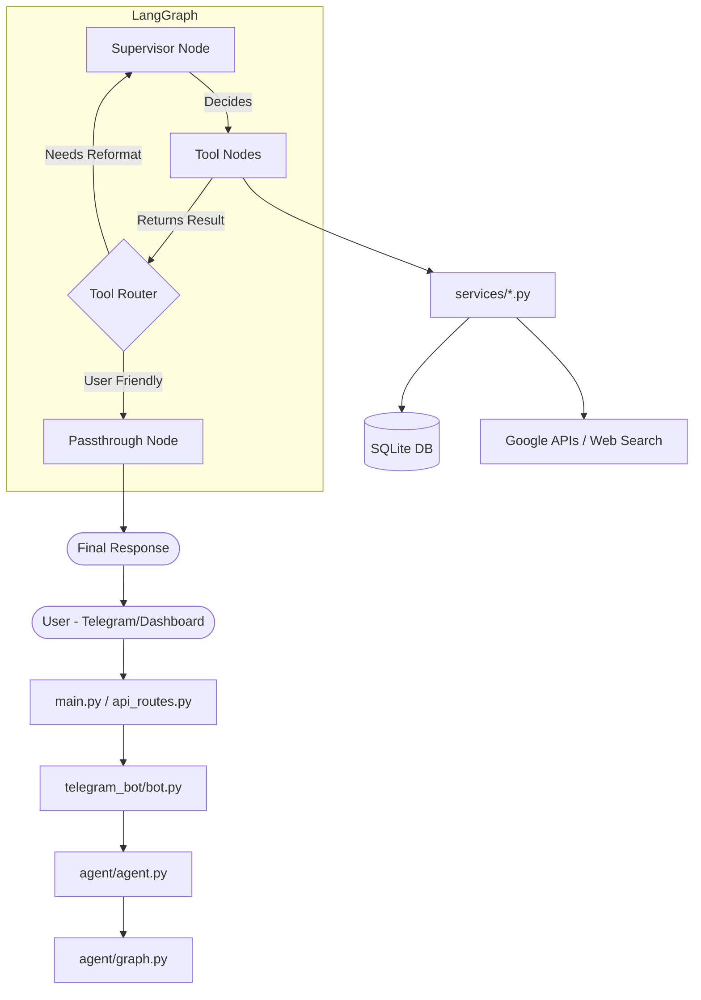

# AI Bot Project Walkthrough

This document provides a comprehensive overview of the AI Bot codebase, its architecture, and how its various components interact.

## 🌟 Project Overview
The AI Bot (codenamed **BORG**) is a personal digital assistant designed for career management, productivity tracking, and personal data management. It features a Telegram bot interface and a web-based dashboard.

## 🛠 Tech Stack
- **Backend**: Python with FastAPI
- **Bot Framework**: `python-telegram-bot`
- **AI/LLM**: LangChain, LangGraph, Google Gemini (via Vertex AI/Gemini API)
- **Database**: SQLite (managed with `sqlite3` and `db_service.py`)
- **Frontend**: Vanilla JS/HTML/CSS (Notion-style Dashboard)
- **Other Services**: Google OAuth (Calendar, Gmail, Sheets), Playwright (Web Search/Scraping)

## 📁 Directory Structure
```text
/home/arjun/bot/
├── main.py              # Entry point: FastAPI app + Bot initialization
├── api_routes.py        # Dashboard API endpoints
├── agent/               # Core AI logic (LangGraph)
│   ├── graph.py         # Graph structure and routing
│   ├── nodes.py         # Node implementations (Supervisor, Tools)
│   ├── tools.py         # LangChain tool definitions
│   └── prompts.py       # System prompts and instruction sets
├── services/            # Feature-specific implementations
│   ├── db_service.py    # Database operations (CRUD)
│   ├── llm_service.py   # LLM initialization and wrapping
│   ├── google_auth_service.py # OAuth management
│   ├── reminder_service.py    # APScheduler integration
│   └── ...              # Other services (Finance, Food, Resume, etc.)
├── core/                # Shared configurations and models
│   ├── config.py        # Pydantic settings
│   ├── context.py       # Thread-local context management
│   └── models.py        # Pydantic/TypedDict models
├── telegram_bot/        # Bot handlers and UI
│   └── bot.py           # Telegram event handlers
├── static/              # Dashboard frontend files
└── db/                  # SQLite database storage
```

## 🔄 Data Flow
The system follows a reactive architecture where the **Supervisor** manages the flow of information.



## 🧠 Key Components

### 1. The Agent (LangGraph)
- **Supervisor**: The brain of the operation. It uses a system prompt that includes user "facts" retrieved from the DB.
- **In-Memory Cache**: `nodes.py` implements a TTL-based cache for user facts and recent history to minimize DB overhead.
- **Tooling**: Over 20 tools are available, ranging from `manage_todos` to `analyze_missing_skills`.

### 2. Database Layer (`db_service.py`)
- A single-user optimized SQLite schema.
- **WAL Mode**: Enabled for better concurrency between the Bot and the Dashboard.
- **Heuristic Fact Extraction**: Automatically extracts persistent facts from conversation history in the background.

### 3. Services Architecture
- Services are decoupled from the agent logic.
- **Reminder Service**: Uses `APScheduler` for persistent background tasks (cron or one-off).
- **Google Services**: Integrated via `google_auth_service.py`, supporting Gmail, Calendar, and Sheets.

## 📝 For the AI Assistant (Editing Tips)
- **Context Management**: When modifying tools, check `agent/tools.py` first. Ensure tool arguments are well-documented for the LLM.
- **Response Format**: Many tools return raw data that the **Supervisor** reformats. If a tool output should be shown directly, add it to the `NEEDS_LLM_REFORMAT` exclusion list in `agent/graph.py`.
- **Database Changes**: Always update `init_db()` in `services/db_service.py` if adding new tables or columns.
- **Gemini Compatibility**: Use `strip_thought_blocks()` in `nodes.py` if modifying how history is persisted, as Gemini 3 "thinking" models have specific replay constraints.

## 🚀 Getting Started
1. Run `make setup` to initialize the environment.
2. Run `make token` to generate Google OAuth credentials.
3. Run `make run` to start the FastAPI server and Telegram bot simultaneously.
